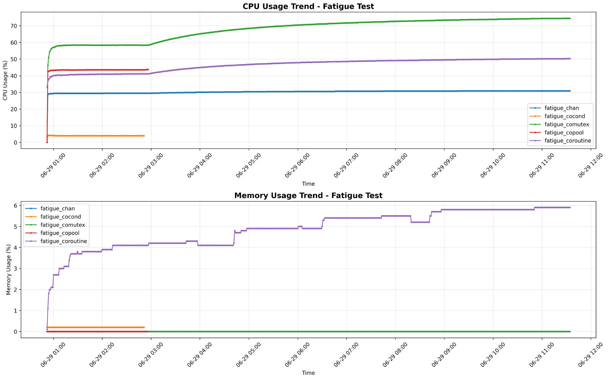

# 疲劳测试结果


## 12小时疲劳测试

测试例程在benchmark_test/fatigue_[*].cc

测试结果如下：



因为在3点前，fatigue_cocond、fatigue_copool结束了，所以其他几个测试例程吃到的cpu更多了。所以内存和cpu有所增长。整体处于合理范畴内。

## 压力测试

100w协程执行耗时，测试例程在benchmark_test/compare下

机型1：13th Gen Intel(R) Core(TM) i7-13790F + 8G内存 + ubuntu22.04

机型2：Intel(R) Xeon(R) Platinum 8255C CPU @ 2.50GHz + 8G内存 + ubuntu22.04

机型一：

```

===== libgo_test begin =====
cost time: 3273

real    0m3.292s
user    0m0.424s
sys     0m5.805s


===== bbtco_test begin =====
cost time: 1031

real    0m1.058s
user    0m0.463s
sys     0m1.815s


===== go test begin =====
cost time: 368 ms

real    0m0.550s
user    0m0.301s
sys     0m0.418s

```

机型二：

```

===== libgo_test begin =====
cost time: 2843

real    0m2.859s
user    0m3.384s
sys     0m1.302s


===== bbtco_test begin =====
cost time: 2852

real    0m2.970s
user    0m4.827s
sys     0m0.436s


===== go test begin =====
cost time: 351 ms

real    0m0.436s
user    0m0.707s
sys     0m0.021s

```
